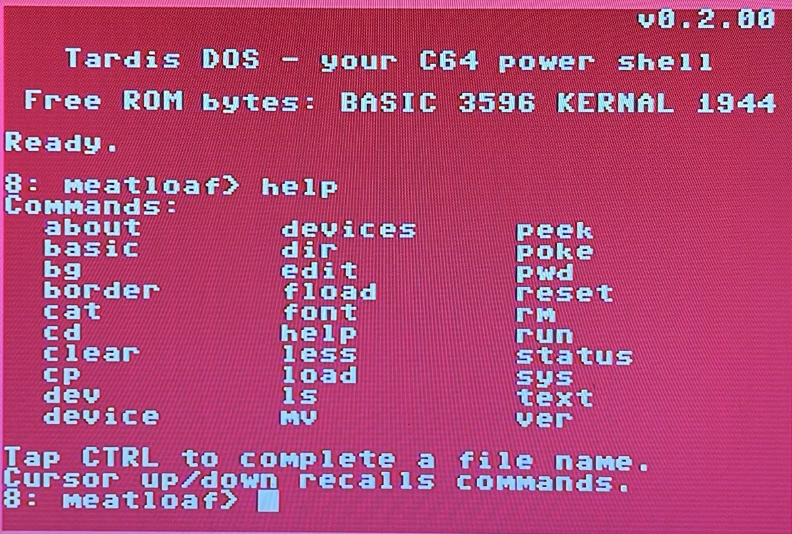
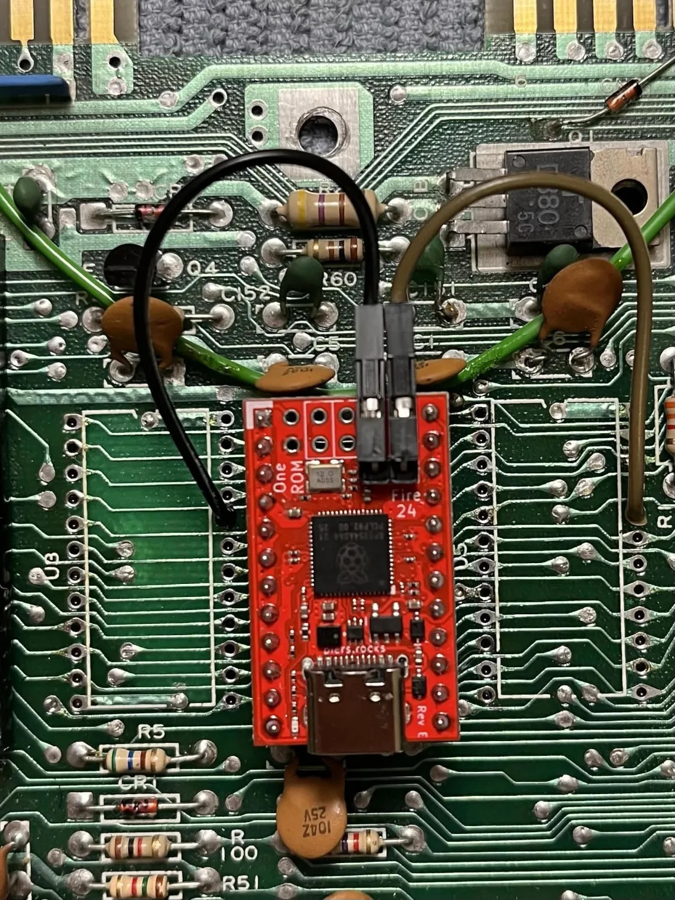

# Tardis DOS

**A modern command-line shell for the Commodore 64 — booting in place of BASIC and the KERNAL.**

Tardis DOS replaces the C64's stock BASIC + KERNAL with a modern command line: line editing, command history, file name tab-completion, a built-in fast loader, disk and file tools, a text editor, and more. Its served from a [OneROM](https://onerom.org/) — a flash-based ROM-replacement chip that drops into the C64's internal KERNAL/BASIC ROM sockets. It is **not** a cartridge, and it's **not** Linux. It's just your Commodore with shell commands that are familiar.

<p align="center">
  
</p>

## Bigger on the inside

The C64's ROM sockets give you only 16 KB — far too little for a rich shell. Tardis DOS gets around this the same way the [Doctor's TARDIS](https://en.wikipedia.org/wiki/TARDIS) works; _it's bigger on the inside than the outside_. The core lives in the 16 KB ROM, and everything else lives *outside* it, in the OneROM's flash and is swapped in as needed. The result is a shell that does far more than 16 KB.

There's **no BASIC interpreter** — that's a deliberate trade to reclaim 8 KB of ROM. To run legacy software, Tardis DOS hands off to the *genuine* C64 ROMs: on `run` (or inserting a real cartridge), the OneROM hot-swaps back to the stock BASIC/KERNAL and warm-boots before launching the program.

## Features

- **Modern shell** — line editing with cursor movement, insert/delete, an 8-deep command history (↑/↓), and **filename completion** (tap **CTRL** — the C64 has no TAB key), including names with spaces.
- **Epyx-compatible fast loader** — `fload` / `run` stream programs fast; pairs beautifully with the [Meatloaf](https://github.com/idolpx/meatloaf), and will soon also work with a stock 1541, SD2IEC, Pi1541, and 1541 Ultimate.
- **Disk & file tools** — `ls`, `dir`, `cd`, `pwd`, `cp`, `mv`, `rm`, `cat`, `less`, `status`, `device`, driving the IEC bus directly.
- **Text editor** — `edit`, a nano-style editor with cut/copy/paste.
- **Memory tools** — `peek` (with hex-dump), `poke`.
- **Configurable look** — `border` / `bg` / `text` colours, with an interactive colour picker.
- **Switchable fonts & keyboard** — `font` live-swaps the character ROM *and* keyboard layout together (English / Swedish).
- **Persistent settings** — colours, command history, and the selected font survive a power cycle (stored in the OneROM's NV flash).
- **Stock-ROM handoff** — `run` / `basic` swap the OneROM to genuine C64 ROMs to launch BASIC / machine-language programs and cartridges. **RUN/STOP + RESTORE** escapes a launched program back to the shell.

## Hardware

- A **Commodore 64** or **128** (PAL — see [Status](#status--caveats) for NTSC).
- A **[OneROM](https://onerom.org/)** flashed with the Tardis DOS firmware, in the ROM socket.
- Optional but recommended: a **[Meatloaf](https://github.com/idolpx/meatloaf)** (or any IEC drive) for loading software.

## Getting it onto your C64

**Download a build:** grab the firmware image from the [Releases](../../releases) page (e.g. `c64-tardis-dos-vX.Y.ZZ-for-onerom-fire-24-e.bin`) and flash it to your OneROM with the `onerom` CLI. If you use the OneROM **web tool** instead, upload the `.bin` through the **"Local Image" tab** — not "Custom Image" (the release file is a complete, ready-built firmware image, not a ROM to wrap).

**Or build & flash from source** (with the OneROM connected over USB):

```sh
make onerom-flash                          # build the firmware and flash it
make onerom-flash ONEROM_BOARD=fire-28-a   # for a different board
```

This builds the *stock-fallback* firmware: Tardis DOS plus genuine C64 ROMs as a second bank (so `run`/`basic`/cartridges can hand off to the real ROMs). The stock ROMs are user-supplied and live in a gitignored `stock-roms/` directory.

### Installing the OneROM in the C64

Remove all three original ROMs — KERNAL, BASIC, and the character ROM. The
OneROM goes in the **KERNAL socket**, and serves the other two chips as well:
run a wire from each of the OneROM's **x-pins** to the chip-select pin of the
BASIC and character ROM positions — **pin 20** on each, i.e. the 5th pin down
from the top on the right-hand side.

<p align="center">
  
</p>

Dupont pins pushed into the empty sockets' pin-20 holes work fine. For a more
robust install, remove the BASIC and char-ROM sockets and solder the
chip-select wires in directly — that's what's pictured above: the wires are
soldered at the ROM end and connect to the OneROM's x-pins with Dupont
connectors, so the board itself stays removable.

## Building from source

**Toolchain** (all must be on `PATH` — verify with `make check-tools`):

- **[cc65](https://cc65.github.io/)** (built from git master) — C compiler + assembler.
- **[VICE](https://vice-emu.sourceforge.io/)** 3.7+ (`x64sc`) — for the test harness.
- **Python 3** and **GNU Make**.

```sh
make            # build build/kernal.bin ($E000-$FFFF) and build/basic.bin ($A000-$BFFF)
make test       # build and run the test suite (headless VICE)
make run        # launch VICE with the ROM
make run DISK=test/data/test.d64   # ...with a disk attached
make sizes      # per-command ROM size report
```

The 16 KB ROM is two 8 KB halves — `build/kernal.bin` at `$E000` and `build/basic.bin` at `$A000` — that together replace the C64's KERNAL and BASIC ROMs.

## Testing

The test suite drives a headless `x64sc` over VICE's binary monitor, asserting on screen contents, memory, and registers. Tests are Python modules under `test/`, run in parallel:

```sh
make test                 # full suite
VICE_VERBOSE=1 make test  # verbose (monitor traffic, tracebacks)
```

Features that touch the OneROM hardware (the stock-ROM swap, RBCP, NV settings, and the timed fast-loader receive) can't be exercised in VICE and are validated on real hardware.

## Status & caveats

- Developed and tested on **PAL** hardware. NTSC should work for everything except possibly the cycle-timed Epyx fast loader, which is calibrated for PAL; standard `load` is unaffected.
- The stock-ROM handoff, persistent settings, and font switching require a OneROM (they're inert on a plain emulator / shell-only build).
- The character-set half of the Swedish layout under the stock ROMs is still keyboard-only (see the design notes).
- Releases also carry **C64C** and **C128** (C64-mode, U32 socket) images. Those are built from the same source but are not hardware-validated every release — the breadbin images are.

## Project layout

```
src/            reset, IRQ, KERNAL stubs, IEC bus (asm); shell, parser, the
                resident commands and the bank dispatcher (C)
src/banks/      commands served from flash as ROM banks (disk, files, completion)
src/overlays/   commands streamed into RAM on demand (editor, about)
src/rbcp/       OneROM Bus Control Protocol library + the bank-swap launcher
cfg/            linker + OneROM firmware configs
test/           VICE test harness and per-feature tests
docs/           design notes (RBCP, Epyx receiver, compatibility, ...)
```

## Credits

- **[Piers Finlayson](https://piers.rocks/)** — the [OneROM](https://onerom.org/) and the ROM Bus Control Protocol that make the whole thing possible.
- **[Meatloaf](https://github.com/idolpx/meatloaf)** — the IEC device Tardis DOS is happiest paired with.
- Built with the **[cc65](https://cc65.github.io/)** toolchain and tested under **[VICE](https://vice-emu.sourceforge.io/)**.
- Genuine C64 BASIC/KERNAL/character ROMs remain © Commodore and are user-supplied.

Made by Mathias Malmqvist with [Claude Code](https://claude.com/claude-code).
